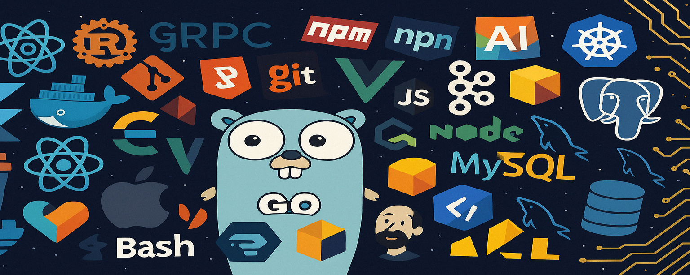

<!-- Banner -->

  

<h1 align="center">👋 Hola, soy Leonardo Rozza</h1>

  

  
  
  
  

---

## Sobre mí

Desarrollador backend con experiencia en Java y Spring Boot, especializado en la creación de APIs REST y microservicios escalables.  
Con conocimientos en JWT, bases de datos SQL (PostgreSQL, MySQL), Docker, y pasión por aprender nuevas tecnologías.

---

## 🛠️ Stack reciente

  

---

## 🚀 Proyectos destacados

| Proyecto                       | ¿Qué hice?                                                          | Enlace                                                               |
| ------------------------------ | ------------------------------------------------------------------- | -------------------------------------------------------------------- |
| **Conexia**                    | Backend completo de una Api-Rest para web de insercion Laboral      | 🔗 [Repo](https://github.com/Leonardo-Rozza/conexia-backend)         |
| **API de Gestión de Usuarios** | REST API en Node + Express con autenticación JWT, control de roles. | 🔗 [Repo](https://github.com/Leonardo-Rozza/API-REST-authentication) |
| **Quinta La Ponderosa**        | Sitio web responsivo creado con Astro, HTML, CSS.                   | 🔗 [Live](https://leonardo-rozza.github.io/La-Ponderosa/)            |
